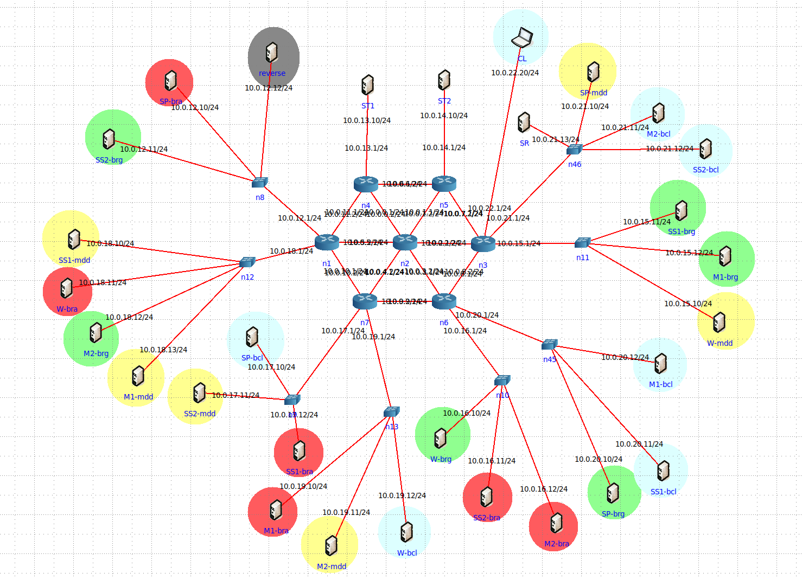

# DNS System 💻🌐💻
### Group - [José Fonte](https://github.com/josefonte) | [Miguel Raposo](https://github.com/MiguelRaposo) Grade: 19.2

As part of the Computer Communications course, the group developed a DNS System and a network topology to test it. The group completed the following tasks:

- __Task 1__: Build a Test Environment (Primary Servers, Secondary Servers, Top-Level Servers).
- __Task 2__: Specify the Communication Model.
- __Task 3__: Specify the Information Model.
- __Task 4__: Construct a CL, SP (SP, SDT, and ST), SS, and SR.
- __Task 5__: Zone Transfer between SP and SS.
- __Task 6__: Iterative and Recursive Processing of DNS queries.

    

`To test, see page 38 of the Report`

Computer Communications | 3rd Year | 1st Semester | University of Minho | Integrated Master's in Software Engineering | Academic Year 22/23
